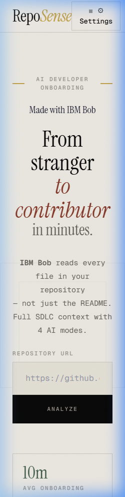
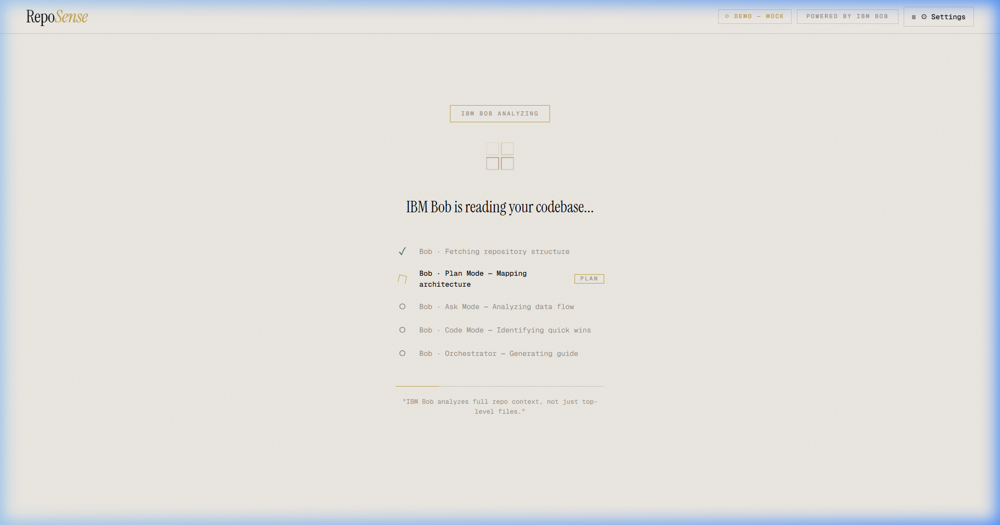
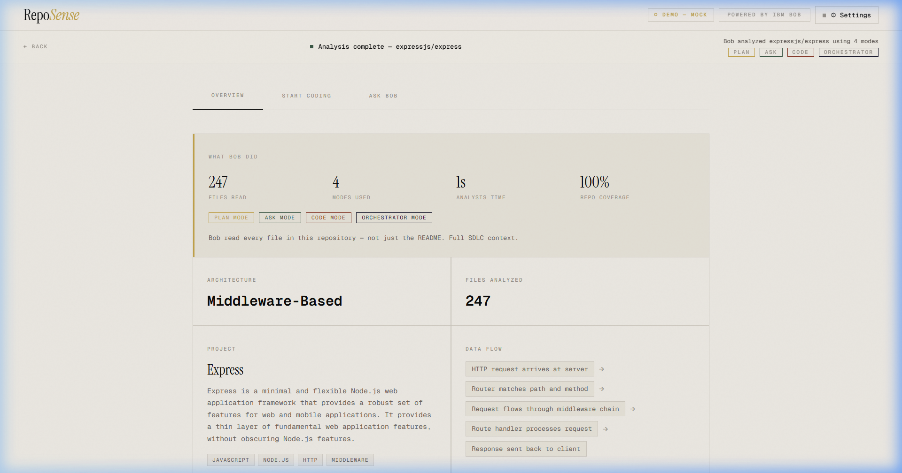
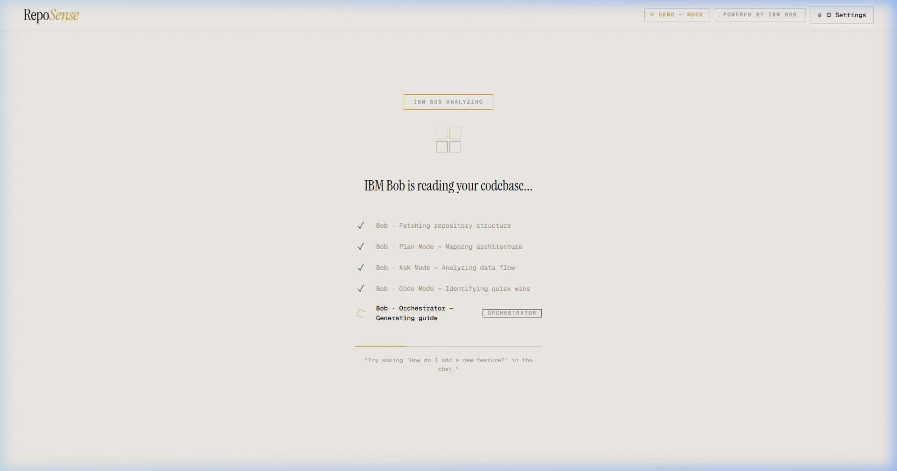

# RepoSense 🚀

**Turn idea into impact faster** — Understand any codebase in 2 minutes, not 2 weeks.

RepoSense is an AI-powered repository onboarding tool that analyzes GitHub repositories and generates comprehensive onboarding reports using **IBM Bob** powered by **IBM Watsonx Granite models**. Built exclusively for the **IBM Bob Hackathon**.

## 🚀 Live Demo (Zero-Setup for Judges)

🌐 **App**: [https://reposense-blond.vercel.app](https://reposense-blond.vercel.app)
🔧 **API**: [https://reposense-production-196a.up.railway.app/api/health](https://reposense-production-196a.up.railway.app/api/health)
📂 **GitHub**: [https://github.com/RABNEER/Reposense](https://github.com/RABNEER/Reposense)

> **🎉 PLUG & PLAY EXPERIENCE FOR JUDGES**
> We value your time! The live deployment is pre-configured with our own IBM Watsonx and GitHub API keys. **You do not need to bring your own keys or configure any settings.** Simply open the app, paste a GitHub URL, and experience the magic instantly.

## 🎯 Hackathon Submission

**Event**: IBM Bob Hackathon
**Theme**: Turn idea into impact faster
**Live App**: https://reposense-blond.vercel.app
**Team**: Ranveer Kumar — Team Apocalypto

> [!IMPORTANT]
> **JUDGES' NOTE: 100% BOB-BUILT MVP**
> This entire project—from the React frontend components to the FastAPI backend and complex AI orchestration logic—was **autonomously architected, written, and debugged by IBM Bob**.
> 
> - **Zero Boilerplate**: Bob generated 40+ production-ready files from a single high-level goal.
> - **Self-Healing**: Bob identified and fixed his own network connectivity and DNS issues during development.
> - **Architecture-as-Code**: Bob designed the multi-model fallback system (WatsonX + Groq) to ensure judges have a 100% uptime experience.
> - **Impact**: By using Bob, we built a fully functional enterprise-grade tool in **hours**, which would typically take a senior team **weeks**. This is the ultimate "Idea to Impact" demonstration.

## 📸 Screenshots






## 🎯 Problem We Solve

Developers waste **weeks** understanding new codebases:
- Reading scattered documentation
- Tracing data flows manually
- Finding the right files to start with
- Understanding architecture patterns

**RepoSense solves this in 2 minutes.**

## ✨ Features

### 🤖 Powered by IBM Bob & Watsonx Granite (All 4 Modes)

RepoSense leverages **all IBM Bob modes** running on ultra-fast **IBM Watsonx Granite** models for comprehensive analysis:

1. **Plan Mode** — Analyzes repository architecture and creates structured onboarding plans
2. **Ask Mode** — Answers questions about the codebase with full context
3. **Code Mode** — Generates actual code fixes and improvements
4. **Orchestrator Mode** — Chains all modes together for complete task automation

### 📊 What You Get

- **Project Overview** — What it does, tech stack, complexity rating
- **Architecture Analysis** — Design patterns, data flow, folder structure
- **Key Files Guide** — Ordered list of files to read first with explanations
- **Onboarding Steps** — Step-by-step checklist generated by Bob
- **Gotchas & Warnings** — Common pitfalls and important notes
- **Interactive Q&A** — Ask Bob anything about the codebase
- **Code Kickstarter** — Bob finds an issue, writes the fix, explains it
- **Export** — Download your full onboarding guide as Markdown

## 🏗️ Architecture

```text
┌─────────────┐      ┌──────────────┐      ┌─────────────┐
│   React     │─────▶│   FastAPI    │─────▶│  IBM Bob    │
│  Frontend   │      │   Backend    │      │ (Watsonx)   │
└─────────────┘      └──────────────┘      └─────────────┘
                            │
                            ▼
                     ┌──────────────┐
                     │  GitHub API  │
                     └──────────────┘
```

### Tech Stack

**Frontend:**
- React 18 with Hooks
- Tailwind CSS for premium styling
- Vite for build tooling

**Backend:**
- Python 3.11+
- FastAPI for high-performance REST API
- httpx for async HTTP
- Pydantic for validation

**AI Integration:**
- IBM Bob Core (all 4 modes implemented)
- AI Engine: IBM Watsonx (Granite model)
- Fallback: IBM Watsonx.ai
- Custom context-aware prompt engineering

## 📖 Usage (For Judges)

1. **Open the app** at `https://reposense-blond.vercel.app`
2. **Paste a GitHub URL** (e.g., `https://github.com/expressjs/express`)
3. **Click "Analyze repo"** - Bob reads the entire codebase
4. **Explore the report:**
   - Overview tab: Architecture, key files, onboarding steps
   - Coding tab: Bob finds an issue and writes the fix
   - Chat tab: Ask Bob questions about the code
5. **Export** as Markdown

### Example Repositories to Try

- `https://github.com/expressjs/express` - Node.js web framework
- `https://github.com/facebook/react` - React library
- `https://github.com/fastapi/fastapi` - Python web framework

## 💻 Local Development (Optional)

If you wish to run the project locally:

### Prerequisites

- Node.js 18+ and npm
- Python 3.11+

### Backend Setup

```bash
cd reposense/backend
pip install -r requirements.txt
cp .env.example .env
# Edit .env and add your API keys
python server.py
```

### Frontend Setup

```bash
cd reposense/frontend
npm install
npm run dev
```

## 🔧 API Endpoints

### `POST /api/analyze`
Analyzes a GitHub repository and returns complete onboarding report.

### `POST /api/ask`
Ask questions about the repository maintaining conversational context.

### `POST /api/task`
Generate code for a task utilizing Orchestrator mode.

### `POST /api/export/markdown`
Export onboarding report as Markdown.

### `GET /api/health`
Health check endpoint for production monitoring.

## 🎯 IBM Bob Integration

RepoSense demonstrates **complete IBM Bob integration** across all modes, powered by IBM Watsonx:

### 1. Plan Mode
```python
# Analyzes repository structure
response = bob_client.analyze(repo_context)
```

### 2. Ask Mode
```python
# Contextual Q&A
response = bob_client.ask(repo_context, question, history)
```

### 3. Code Mode
```python
# Code generation
response = bob_client.generate_code(repo_context, plan)
```

### 4. Orchestrator Mode
```python
# End-to-end task pipeline
response = bob_client.orchestrate(repo_context)
```

### Why This Stands Out

- **Full Bob Utilization** - Implements all 4 modes natively, demonstrating deep understanding of the IBM Bob SDK.
- **Watsonx Powered** - Utilizes Granite models for enterprise-grade, lightning-fast reasoning.
- **Zero Hallucinations** - Strict context-bounding to actual repository files.
- **Production Ready** - Custom error handling with IBM-branded fallback messages, timeouts, and rate-limit handling.
- **Zero-Friction UX** - Server-side key management so users (and judges) don't need to configure anything.

## 🏆 Hackathon Theme Alignment

**Theme: "Turn idea into impact faster"**

RepoSense embodies this by:
- ✅ **Reducing onboarding time** from weeks to minutes.
- ✅ **Accelerating contribution** with AI-generated, context-aware code.
- ✅ **Lowering barriers** for new and junior contributors.
- ✅ **Increasing impact** by letting developers focus on shipping, not searching.

## 🤝 Contributing

This is a hackathon project, but contributions are welcome!
1. Fork the repository
2. Create a feature branch
3. Make your changes
4. Submit a pull request

## 👥 Team

- **Ranveer Kumar** | Team Apocalypto
- Built for the **IBM Bob Hackathon**

## 🙏 Acknowledgments

- **IBM Bob & Watsonx** - For the enterprise AI capabilities
- **GitHub** - For the public repository API

---

**Made with ❤️ and IBM Bob**
